# Markdown Abyssal Syntax

  

[:arrow_left: Return to Main README](../README.md)  

[:arrow_left: Return to Markdown Experiment README](/markdown-basics/MarkdownExperiment.md)  
[:arrow_left: Return to Markdown Extended README](/markdown-basics/MarkdownExtended.md)

> ***This is a refactored version from the `ipynb` file. With a more intuitive interface.***

## Sections

> * [`Five Distinct Alert Callout Styles`](#five-distinct-alert-callout-styles)
> * [`Collapsible Dropdowns`](#collapsible-dropdowns)
> * [`Hex Color Previews`](#hex-color-previews)
> * [`Mermaid Diagrams`](#mermaid-diagrams)
>     * [`Flowcharts`](#flowcharts)
>     * [`Git Graphs`](#git-graphs)
>     * [`Project Timelines`](#project-timelines)
> * [`Keyboard Key Visuals`](#keyboard-key-visuals)
> * [`File Diff Colorization`](#file-diff-colorization)


## [Five Distinct Alert Callout Styles](#sections)

***Syntax:***

```txt
> [!NOTE]
> Highlights information that users should take into account, even when skimming.

> [!TIP]
> Optional information to help a user be more successful.

> [!IMPORTANT]
> Crucial information necessary for users to succeed or avoid turning a corner.

> [!WARNING]
> Critical content demanding immediate user attention to prevent irreversible bugs.

> [!CAUTION]
> Negative consequences of an action or severe security risks.
```

***Result:***

> [!NOTE]
> Highlights information that users should take into account, even when skimming.

> [!TIP]
> Optional information to help a user be more successful.

> [!IMPORTANT]
> Crucial information necessary for users to succeed or avoid turning a corner.

> [!WARNING]
> Critical content demanding immediate user attention to prevent irreversible bugs.

> [!CAUTION]
> Negative consequences of an action or severe security risks.

---

## [Collapsible Dropdowns](#sections)

***Syntax:***

```txt
    <details>
    <summary>Click to view full log details</summary>

    ```bash
    # This content remains hidden until the user clicks the arrow
    git log --oneline --graph --all
    ```
    </details>
```
---

***Result:***

<details>
<summary>Click to view full log details</summary>

```bash
# This content remains hidden until the user clicks the arrow
git log --oneline --graph --all
```
</details>


## [Hex Color Previews](#sections)

***Syntax:***
```md
    * Primary Theme Color: `#4A2B1C`
    * Warning Alert Accent: `#D97706`
```

***Result:***

* Primary Theme Color: `#4A2B1C`
* Warning Alert Accent: `#D97706`
## [Mermaid Diagrams](#sections)

### [Flowcharts](#sections)

> * **Shapes**
>     * [Rectangle & Decision Shape Pairing](#rectangle--decision-shape-pairing)
>     * [Rounded & Stadium Shape Pairing](#rounded--stadium-shape-pairing)
>     * [Circle & Hexagon Shape Pairing](#circle--hexagon-shape-pairing)
>     * [Standard Parallelogram & Alternate Parallelogram Shape Pairing](#standard-parallelogram--alternate-parallelogram-shape-pairing)
>     * [Standard Trapezoid & Alternate Trapezoid Shape Pairing](#standard-trapezoid--alternate-trapezoid-shape-pairing)
>     * [Asymmetric Banner & Subroutine Shape Pairing](#asymmetric-banner--subroutine-shape-pairing)
>     * [Double Circle & Database Cylinder Shape Pairing](#double-circle--database-cylinder-shape-pairing)
> * **Lines**
>     * [Solid Line & Standard Arrow Line Transitions](#solid-line--standard-arrow-line-transitions)
>     * [Dotted Line & Dotted Arrow Line Transitions](#dotted-line--dotted-arrow-line-transitions)
>     * [Thick Line & Thick Arrow Line Transitions](#thick-line--thick-arrow-line-transitions)
>     * [Two-Way Arrow & Cross Head Line Transitions](#two-way-arrow--cross-head-line-transitions)
>     * [Circle Head & Double Cross Head Line Transitions](#circle-head--double-cross-head-line-transitions)
>     * [Double Circle Head Line Transitions](#double-circle-head-line-transitions)

---

#### [Rectangle & Decision Shape Pairing](#flowcharts)

***Syntax:***
```md
    ```mermaid
    graph TD
    A[Rectangle Node A] ~~~ B{Decision Node B}
    ```
```

***Result:***

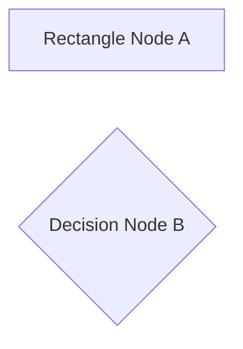

---

#### [Rounded & Stadium Shape Pairing](#flowcharts)

***Syntax:***
```md
    ```mermaid
    graph TD
    C(Rounded Node C) ~~~ D([Stadium Node D])
    ```
```

***Result:***

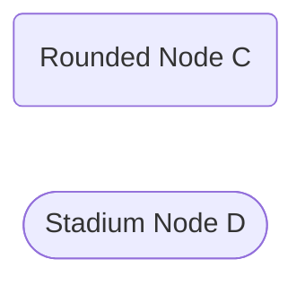

---

#### [Circle & Hexagon Shape Pairing](#flowcharts)

***Syntax:***
```md
    ```mermaid
    graph TD
    E((Circle Node E)) ~~~ F{{Hexagon Node F}}
    ```
```

***Result:***

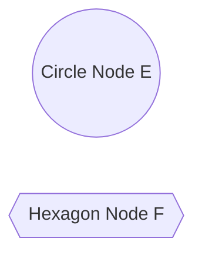

---

#### [Standard Parallelogram & Alternate Parallelogram Shape Pairing](#flowcharts)

***Syntax:***
```md
    ```mermaid
    graph TD
    G[/Parallelogram Node G/] ~~~ H[\Parallelogram Alt Node H\]
    ```
```

***Result:***

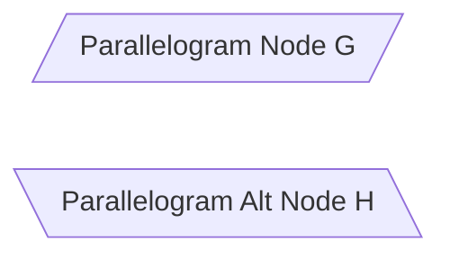

---

#### [Standard Trapezoid & Alternate Trapezoid Shape Pairing](#flowcharts)

***Syntax:***
```md
    ```mermaid
    graph TD
    I[/Trapezoid Node I\] ~~~ J[\Trapezoid Alt Node J/]
    ```
```

***Result:***

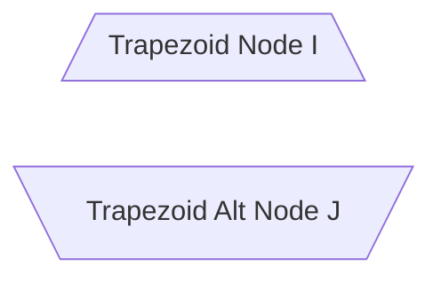

---

#### [Asymmetric Banner & Subroutine Shape Pairing](#flowcharts)

***Syntax:***
```md
    ```mermaid
    graph TD
    K>Asymmetric Node K] ~~~ L[[Subroutine Node L]]
    ```
```

***Result:***

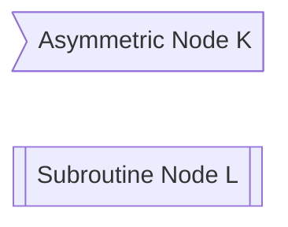

---

#### [Double Circle & Database Cylinder Shape Pairing](#flowcharts)

***Syntax:***
```md
    ```mermaid
    graph TD
    M(((Double Circle Node M))) ~~~ N[(Database / Cylinder Node N)]
    ```
```

***Result:***

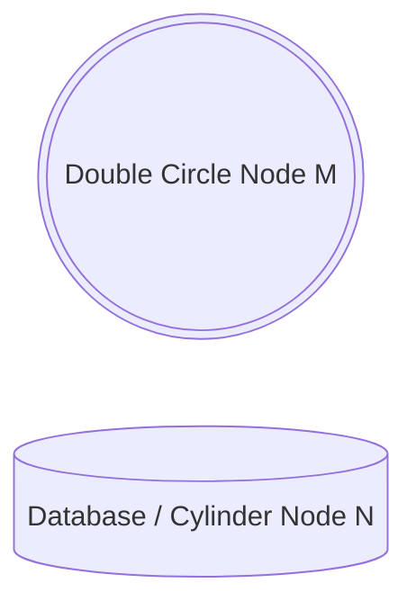

---

#### [Solid Line & Standard Arrow Line Transitions](#flowcharts)

***Syntax:***
```md
    ```mermaid
    graph TD
    A[Rectangle Node A] --- |Solid Line| B{Decision Node B}
    C(Rounded Node C) --> |Standard Arrow| D([Stadium Node D])
    ```
```

***Result:***

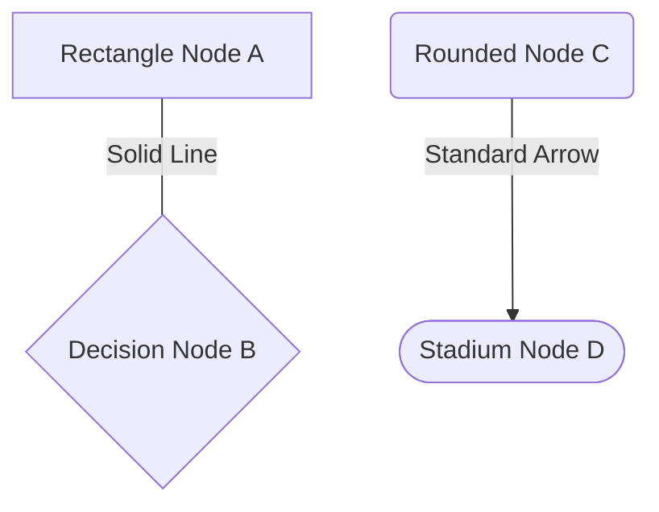

---

#### [Dotted Line & Dotted Arrow Line Transitions](#flowcharts)

***Syntax:***
```md
    ```mermaid
    graph TD
    E((Circle Node E)) -.- |Dotted Line| F{{Hexagon Node F}}
    G[/Parallelogram Node G/] -.-> |Dotted Arrow| H[\Parallelogram Alt Node H\]
    ```
```

***Result:***

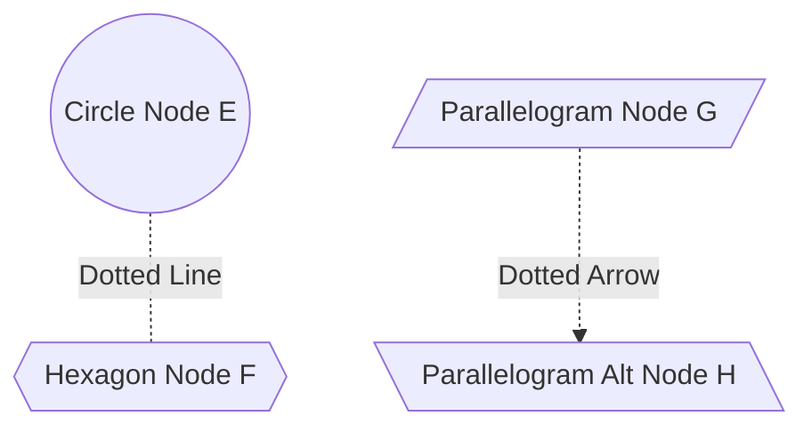

---

#### [Thick Line & Thick Arrow Line Transitions](#flowcharts)

***Syntax:***
```md
    ```mermaid
    graph TD
    I[/Trapezoid Node I\] === |Thick Line| J[\Trapezoid Alt Node J/]
    K>Asymmetric Node K] ==> |Thick Arrow| L[[Subroutine Node L]]
    ```
```

***Result:***

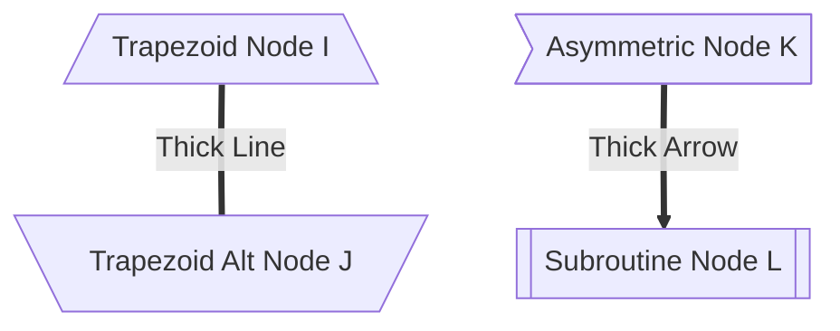

---

#### [Two-Way Arrow & Cross Head Line Transitions](#flowcharts)

***Syntax:***
```md
    ```mermaid
    graph TD
    M(((Double Circle Node M))) <--> |Two-Way Arrow| N[(Database / Cylinder Node N)]
    A[Rectangle Node A] --x |Cross Head| B{Decision Node B}
    ```
```

***Result:***

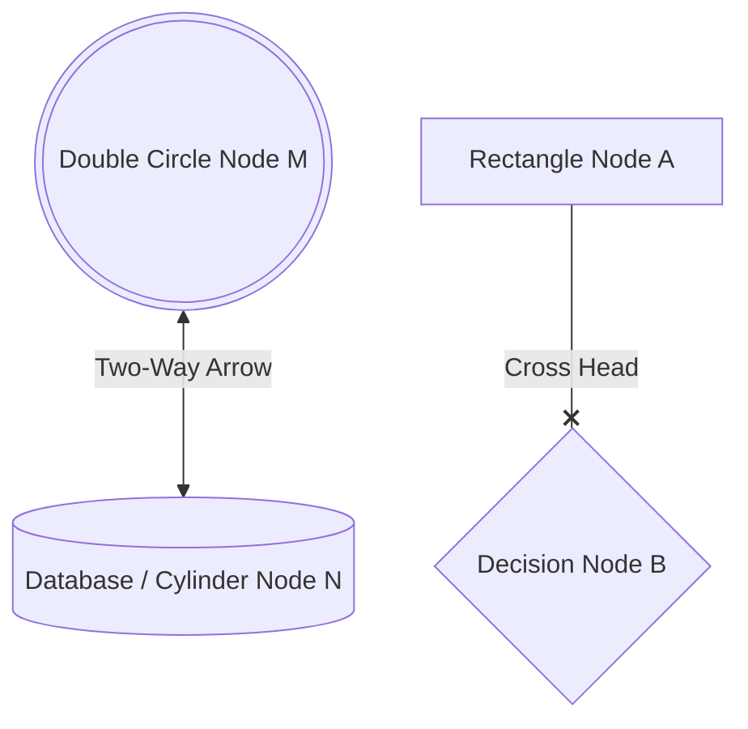

---

#### [Circle Head & Double Cross Head Line Transitions](#flowcharts)

***Syntax:***
```md
    ```mermaid
    graph TD
    C(Rounded Node C) --o |Circle Head| D([Stadium Node D])
    E((Circle Node E)) x--x |Double Cross Heads| F{{Hexagon Node F}}
    ```
```

***Result:***

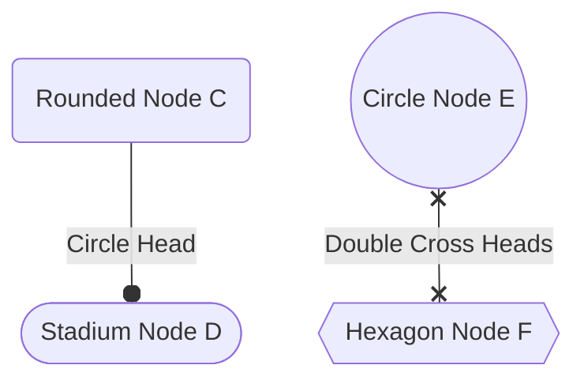

---

#### [Double Circle Head Line Transitions](#flowcharts)

***Syntax:***
```md
    ```mermaid
    graph TD
    G[/Parallelogram Node G/] o--o |Double Circle Heads| H[\Parallelogram Alt Node H\]
    ```
```

***Result:***

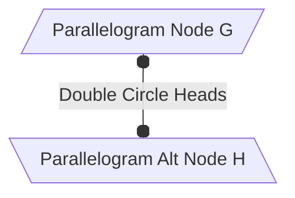

---

### [Git Graphs](#sections)

> * **Foundations & Core Commands**
>     * [Standard Commit Sequences](#standard-commit-sequences)
>     * [Commit Tags](#commit-tags)
>     * [Branch Creation & Checkout Switching](#branch-creation--checkout-switching)
>     * [Merging Branches](#merging-branches)
> * **Advanced Graph Components**
>     * [Custom Commit Types & Styles](#custom-commit-types--styles)
>     * [Cherry-Pick Operations](#cherry-pick-operations)

---

#### [Standard Commit Sequences](#git-graphs)

***Syntax:***
```md
    ```mermaid
    gitGraph
        commit id: "Initial"
        commit id: "feat: setup core"
        commit id: "docs: add readme"
    ```
```

***Result:***

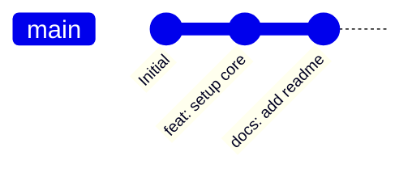

---

#### [Commit Tags](#git-graphs)

***Syntax:***
```md
    ```mermaid
    gitGraph
        commit id: "Initial"
        commit id: "feat: login" tag: "v1.0.0"
        commit id: "fix: auth bypass" tag: "v1.0.1-patch"
    ```
```

***Result:***

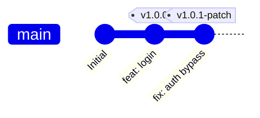

---

#### [Branch Creation & Checkout Switching](#git-graphs)

***Syntax:***
```md
    ```mermaid
    gitGraph
        commit id: "Initial"
        branch feature-ui
        checkout feature-ui
        commit id: "ui: component grid"
        checkout main
        commit id: "hotfix: navbar layout"
    ```
```

***Result:***

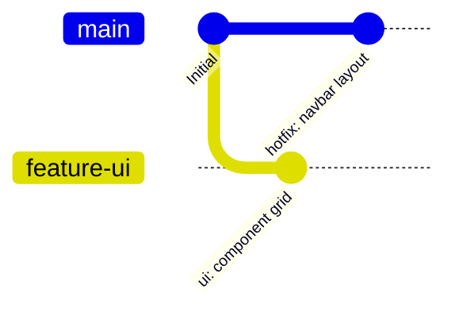

---

#### [Merging Branches](#git-graphs)

***Syntax:***
```md
    ```mermaid
    gitGraph
        commit id: "Initial"
        branch feature-api
        checkout feature-api
        commit id: "api: schema configuration"
        checkout main
        merge feature-api
        commit id: "v1.1.0 Release"
    ```
```

***Result:***

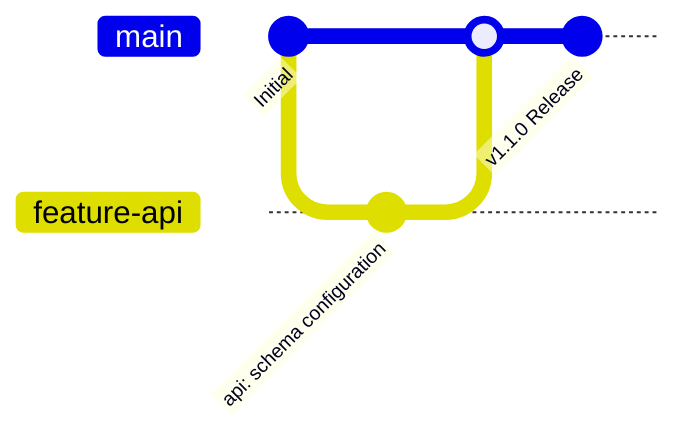

---

#### [Custom Commit Types & Styles](#git-graphs)

***Syntax:***
```md
    ```mermaid
    gitGraph
        commit id: "Normal Commit"
        commit id: "Reverse/Revert" type: REVERSE
        commit id: "Empty/Highlight" type: HIGHLIGHT
    ```
```

***Result:***

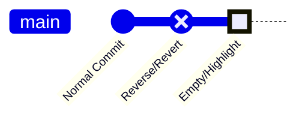

---

#### [Cherry-Pick Operations](#git-graphs)

***Syntax:***
```md
    ```mermaid
    gitGraph
        commit id: "Initial"
        branch staging
        checkout staging
        commit id: "feat: data parser" id: "parser-commit"
        checkout main
        cherry-pick id: "parser-commit"
    ```
```

***Result:***

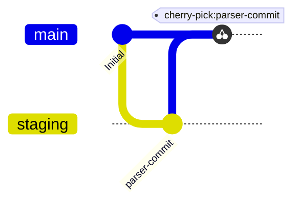

---

### [Project Timelines](#sections)

> * **Structural Elements**
>     * [Standard Milestone Timeline](#standard-milestone-timeline)
>     * [Multi-Event Era Columns](#multi-event-era-columns)
>     * [Multi-Task Event Containers](#multi-task-event-containers)

#### [Standard Milestone Timeline](#project-timelines)

***Syntax:***
```md
    ```mermaid
    timeline
        title Project Milestones
        2024 : Git Core Basics Setup
        2025 : Branching Strategies
        2026 : Final Release
    ```
```

***Result:***

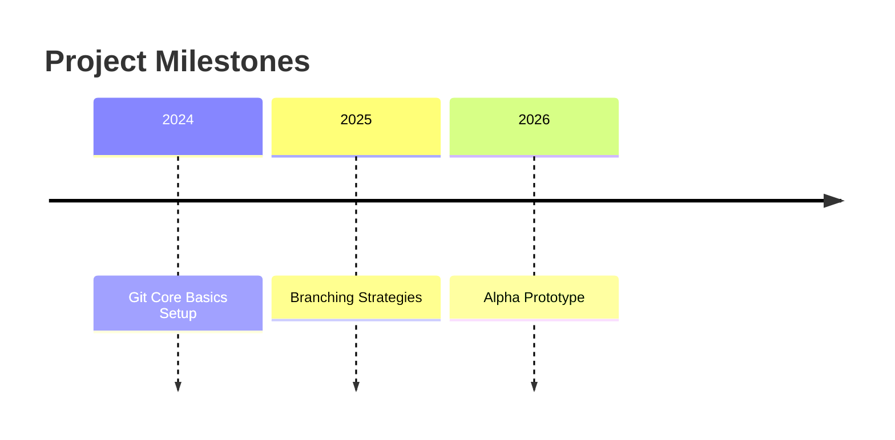

---

#### [Multi-Event Era Columns](#project-timelines)

***Syntax:***
```md
    ```mermaid
    timeline
        title Development Phases
        Q1 2026 : Initial Planning : UI Prototyping
        Q2 2026 : API Core Engine : Database Integration
    ```
```

***Result:***

```mermaid
timeline
    title Development Phases
    Q1 2026 : Initial Planning : UI Prototyping
    Q2 2026 : API Core Engine : Database Integration
```

---

#### [Multi-Task Event Containers](#project-timelines)

***Syntax:***
```md
    ```mermaid
    timeline
        title Phase Deliverables
        2024 : Git Core Basics Setup : Project Structure Established
        2025 : Branching Strategies : Team Workflows Documented
        2026 : Automation CI/CD : GitHub Actions Implemented
    ```
```

***Result:***

```mermaid
timeline
    title Phase Deliverables
    2024 : Git Core Basics Setup : Project Structure Established
    2025 : Branching Strategies : Team Workflows Documented
    2026 : Alpha Prototype : Prototype Developed
```


## [Keyboard Key Visuals](#sections)

***Syntax:***

```md
The <kbd>SPACE</kbd> Button. 
```

***Result:***

The <kbd>SPACE</kbd> Button. 


## [File Diff Colorization](#sections)

***Syntax:***

```md
    ```diff
    - git checkout -b feature-branch
    + git switch -c feature-branch
    ```
```

***Result:***

```diff
- git checkout -b feature-branch
+ git switch -c feature-branch
```
